# Kalshi Algorithmic Market Maker Bot

This project is a fully-functional algorithmic **market-making trading bot** built for the Kalshi prediction market platform. Its primary goal is to provide dual-sided liquidity (bids and asks) on Kalshi markets to capture the bid-ask spread while actively managing inventory risk.

## Quick Start

1. **Clone and install dependencies:**
   ```bash
   git clone https://github.com/KelCodesStuff/Kalshi-Trading-Bot.git
   cd Kalshi-Trading-Bot
   pip install -r requirements.txt
   ```
2. **Configure environment:**
   ```bash
   cp .env.example .env
   # Add your Kalshi Demo API credentials and RSA key paths to .env
   ```
3. **Run the bot loop:**
   ```bash
   python main.py
   ```

## System Architecture

```mermaid
graph TD
    subgraph GrafanaCloud ["Grafana Cloud (Managed Monitoring)"]
        Grafana[Grafana Dashboards] -->|Visualize Metrics| CloudProm[Prometheus Database]
    end

    subgraph DigitalOcean ["DigitalOcean Droplet (Cloud VPS)"]
        Alloy[Grafana Alloy Daemon]

        subgraph DockerContainer ["Docker Container: kalshi-bot"]
            BotLoop[Avellaneda-Stoikov Bot Loop]
            OrderBook[Orderbook Manager]
            InvManager[Inventory Manager]
            OrderManager[Order Manager]
            KillSwitch[Kill Switch]
            Auth[RSA Cryptographic Auth]
        end
    end

    subgraph External ["External Services"]
        GHCR[GitHub Container Registry] -->|Deploy Image| DockerContainer
        KalshiWS[Kalshi V2 WebSockets] <-->|Real-time Feed & Fills| OrderBook
        KalshiWS <-->|Fills| InvManager
        OrderManager -->|REST Order Placement/Cancel| KalshiREST[Kalshi V2 REST API]
        KillSwitch -->|Emergency Cancel| KalshiREST
    end

    %% Flow relationships inside the container
    BotLoop -->|Evaluate Risk & Mid Price| OrderBook
    BotLoop -->|Evaluate Exposure| InvManager
    BotLoop -->|Send Quotes| OrderManager
    BotLoop -.->|Interrupt / Safety Shutdown| KillSwitch
    OrderManager -.->|Register Active IDs| KillSwitch
    Auth -.->|Sign Requests| OrderManager
    Auth -.->|Authorize Connection| KalshiWS

    %% Telemetry pipeline flows
    Alloy -->|Scrape Metrics: Port 8000| BotLoop
    Alloy -->|Push Metrics: Remote Write| CloudProm

    %% Assign styles to subgraph containers
    style GrafanaCloud fill:#172b22,stroke:#2d5a27,stroke-width:2px;
    style DigitalOcean fill:#0f1d2e,stroke:#1f3c5c,stroke-width:2px;
    style External fill:#1f132e,stroke:#3b205c,stroke-width:2px;
    style DockerContainer fill:#142334,stroke:#264870,stroke-width:1px,stroke-dasharray: 5 5;
```



## Codebase Structure

* `auth/` - Secure RSA-PSS signatures for API authentication (`kalshi_auth.py`).
* `data/` - Real-time market feed, orderbook tracking, and position sync.
* `execution/` - Order placement and emergency safety switch (`kill_switch.py`).
* `strategy/` - Avellaneda-Stoikov pricing algorithm.


## Configuration Parameters

| Parameter | Type | Default | Description |
| :--- | :--- | :--- | :--- |
| `KALSHI_ENV` | `string` | `demo` | Kalshi environment connection mode (`demo` or `prod`). |
| `TARGET_TICKER` | `string` | - | The market ticker code to quote (e.g., `INX-26AUG-T5700`). |
| `ORDER_SIZE` | `integer` | `1` | Number of contracts to trade per quote side. |
| `MIN_SPREAD` | `integer` | `4` | The minimum profit margin spread (in cents) required to quote. |
| `RISK_GAMMA` | `float` | `0.05` | Inventory risk aversion parameter. Higher values skew prices faster. |

## Live Output Preview

When running, the bot feeds live log output updating its quotes:

```text
[2026-08-02 22:45:12] INFO: Hydrated initial balance: $1,245.50 | Net Position: 0
[2026-08-02 22:45:14] INFO: WebSocket Connected & Hydrated L2 Orderbook.
[2026-08-02 22:45:15] INFO: Midpoint: 54c | Reservation Price: 54c | Spread: 4c
[2026-08-02 22:45:15] INFO: Placing Quotes -> Bid: 52c (x1) | Ask: 56c (x1)
[2026-08-02 22:45:18] INFO: Fill Event Received: Bought 1 YES at 52c. Position: +1 YES
[2026-08-02 22:45:19] INFO: Skewing quotes due to +1 YES position. Res Price: 53.2c
[2026-08-02 22:45:19] INFO: Replacing Quotes -> Bid: 51c (x1) | Ask: 55c (x1)
```

## Financial Disclaimer

This project is for educational and research purposes only. Algorithmic trading carries significant financial risk. Live trading configuration should only be attempted after thorough testing on the Demo environment. Use at your own risk. The authors are not responsible for any financial losses incurred.
